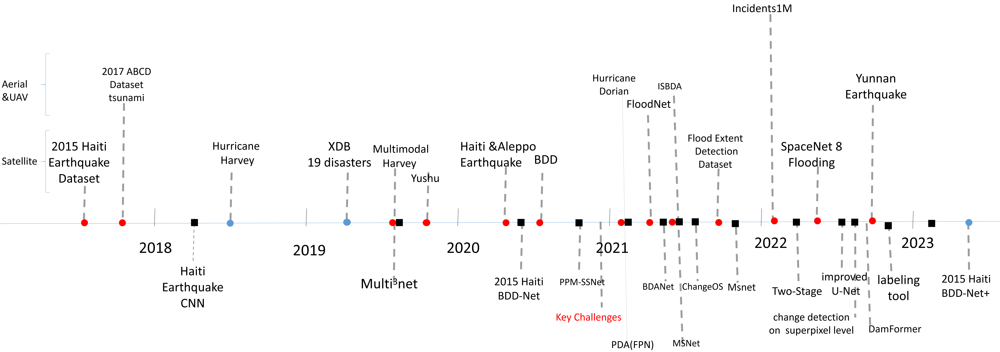

## 1. Natural Disaster Damaged Buildings Datasets

### 1.1. Disaster Damaged Buildings Social Media Datasets

##### 1.1.1. [IncidentsDataset](https://github.com/ethanweber/IncidentsDataset)

### 1.2 Earthquake Damaged Buildings Datasets
#### 1.2.1. 🛰️⚡️[Turkey Earthquake (2023)](https://www.microsoft.com/en-us/research/publication/turkey-earthquake-report/#:~:text=We%20estimate%203%2C849%20buildings%20were%20damaged%2Fdestroyed%20across%20the,some%20level%20of%20damage%20visible%20from%20satellite%20imagery.)
#### 1.2.2. ✈️⚡️[Kaikoura 0.30m Rural Aerial Photos](https://data.linz.govt.nz/layer/95549-kaikoura-030m-rural-aerial-photos-2016-2017/)
#### 1.2.3 ✈️⚡️[Christchurch Post-Earthquake 0.1m Urban Aerial Photos](https://data.linz.govt.nz/layer/51932-christchurch-post-earthquake-01m-urban-aerial-photos-24-february-2011/)

### 1.3 Flooding Damaged Buildings Datasets
#### 1.3.1. [unosat](https://unosat.org/products/) [data](https://maps.disasters.nasa.gov/download/gis_products/event_specific/)
#### 1.3.2. [MLHub Flood](https://mlhub.earth/datasets?search=flood)
#### 1.3.3. [SpaceNet 8](https://spacenet.ai/spacenet-buildings-dataset-v2/)
#### 1.3.4. [FloodNet](https://drive.google.com/drive/folders/1leN9eWVQcvWDVYwNb2GCo5ML_wBEycWD?usp=sharing)
#### 1.3.5. [NASA Flood](https://mlhub.earth/data/nasa_floods_v1)
#### 1.3.6. [global-flood-database](http://global-flood-database.cloudtostreet.info/)
#### 1.3.7. 🛰️⚡️[noaa](geodesy.noaa.gov/storm_archiv)
#### 1.3.8.  [c2smsfloods_v1](https://mlhub.earth/data/c2smsfloods_v1)
#### 1.3.9.  [sen12floods](https://mlhub.earth/data/sen12floods)

### 1.4 Hurricane Damaged Buildings Datasets
##### 1.4.1 ✈️⚡️⚡️[Hurricane Harvey Data|Hurricane Irma Data (CDRP)|Kilauea Eruption Data|Hurricane Michael Data](http://hrail.crasar.org/)

### 1.5 Multi Disaster Damaged Buildings Datasets
#### 1.5.1. xViews
#### 1.5.2. 🛰️⚡️maxar-opendata 

### 1.5 Related Disaster

#### 1.5.1 Platform
##### 1.5.1.1 [Historical global earthquake data](http://ditu.92cha.com/dizhen.php?page=1&dizhen_ly=china&dizhen_zjs=1&dizhen_zje=10&dizhen_riqis=2022-06-01&dizhen_riqie=2023-03-16)
##### 1.5.1.2 [Global Disaster Data Pkatform](https://www.gddat.cn/newGlobalWeb/#/detailsPageNew?id=4956)
##### 1.5.1.3 [灾害风险预警图](http://ditu.92cha.com/)
##### 1.5.1.4 [国家气象数据中心](http://www.nmic.cn/)
##### 1.5.1.5 [Glob Disaster Alert and Coordination System](https://www.gdacs.org/resources.aspx?eventid=1336287&episodeid=1460216&eventtype=EQ)


#### 1.5.2  Buildings Datasets
##### 1.5.2.1 🛰️[global-buildings](https://minedbuildings.blob.core.windows.net/global-buildings)
##### 1.5.2.2 🛰️[CrowdAI Mapping Challenge](https://www.aicrowd.com/challenges/mapping-challenge/dataset_files)
##### 1.5.2.3 🛰️[Massachusetts](https://www.cs.toronto.edu/~vmnih/data/)
##### 1.5.2.4 🛰️[AIRS Dataset](https://www.airs-dataset.com/download/)
##### 1.5.2.5 ✈️[Inria Aerial Image Labeling Dataset](https://project.inria.fr/aerialimagelabeling/files/)
##### 1.5.2.6 ✈️[OpenAire](https://zenodo.org/record/1154821#.ZGN-eE9BztW)
##### 1.5.2.7 ✈️[iSAID](https://captain-whu.github.io/iSAID/dataset.html) (Instance Segmentation)
##### 1.5.2.8 ✈️[DOTA](https://captain-whu.github.io/DOTA/index.html) (Object Detection)
##### 1.5.2.9 ✈️[LINZ DATA SERVICE (Aerial Photos)](https://data.linz.govt.nz/search/?q=Aerial+Photos)


#### 1.5.3 Road Detection Datasets
##### 1.5.3.1 [SpaceNet5](https://medium.com/the-downlinq/spacenet-5-dataset-release-80bd82d7c528)


#### 1.5.4 High resolution satellite
##### 1.5.4.1 [GLOBAL EYE](https://www.imagesatintl.com/home/global-eye/)


#### 1.5.5 Change Detection Datasets
##### 1.5.5.1 [SECOND](http://www.captain-whu.com/PROJECT/SCD/)
##### 1.5.5.2 [CD_Data_GZ](https://github.com/daifeng2016/Change-Detection-Dataset-for-High-Resolution-Satellite-Imagery)
##### 1.5.5.3 [LEVIR-CD](https://justchenhao.github.io/LEVIR/)
##### 1.5.5.4 [LEVIR-CD+](https://justchenhao.github.io/LEVIR/)
##### 1.5.5.5 [SLADCD](http://rs.ia.ac.cn/cp/portal/dataDetail?name=SLADCD)
##### 1.5.5.6 [WHU Building Change detection Dataset](https://study.rsgis.whu.edu.cn/pages/download/building_dataset.html)
##### 1.5.5.7 [Synthetic and real season-varying RS images](https://drive.google.com/file/d/1GX656JqqOyBi_Ef0w65kDGVto-nHrNs9/edit)
##### 1.5.5.8 [HRSCD](https://ieee-dataport.org/open-access/hrscd-high-resolution-semantic-change-detection-dataset)
##### 1.5.5.9 [CDD](https://pan.baidu.com/s/1Xu0kIpThW2koLcyfcJEEfA)
##### 1.5.5.10 [SpaceNet7: Multi-Temporal Urban Development Challeng](https://spacenet.ai/sn7-challenge/)
##### 1.5.5.11 [DSIFN](https://study.rsgis.whu.edu.cn/pages/download/building_dataset.html)
##### 1.5.5.12 [SYSU](https://aistudio.baidu.com/aistudio/datasetdetail/98596)
##### 1.5.5.13 [Sentinel-2 Land Use/ Land Cover Downloader](https://www..com/apps/instant/media/index.html?appid=fc92d38533d440078f17678ebc20e8e2)
##### 1.5.5.14 [Wuhan dataset](study.rsgis.whu.edu.cn/pages/download/building_dataset.html)
##### 1.5.5.15 [MSBC](https://github.com/Lihy256/MSCDUnet)
##### 1.5.5.16 [商汤AI遥感解译大赛-变化检测](https://rs.sensetime.com/competition/index.html#/data)
##### 1.5.5.17 [遥感图像稀疏表征与智能分析竞赛-变化检测](https://pan.baidu.com/s/1GZa_CxzWOcPOS54PM_FM2Q)(提取码：RSAI) 
##### 1.5.5.18 [广东政务数据创新大赛](https://pan.baidu.com/s/12G5VWj8Hd6RFcjKT-9eMRg) (提取码：RSAI)


## 2. tools
### 2.1. [RoadDetection](https://github.com/ruoyxue/RoadDetectionApp/pulse)
### 2.2. ⚡️[MapFlow](https://mapflow.ai/) 
### 2.3. [Spatial imagery labeling toolkit](https://github.com/microsoft/satellite-imagery-labeling-tool)
### 2.4. [anylabeling](https://github.com/vietanhdev/anylabeling/)

## 3. Research Labs of Natural Disaster
#### 3.1. [Disaster Data Science Lab](https://github.com/DDS-Lab) ([Homepage](https://www.ddslab.info/))
#### 3.2 [csail.mit.edu](http://incidentsdataset.csail.mit.edu/)
#### 3.3 [earthobservatory.nasa](https://earthobservatory.nasa.gov/images)
#### 3.4 [Humanitarian Robotics and AI Laboratory at Texas A&M University](http://hrail.crasar.org/)
#### 3.5 [INSTITUTE FOR CLIMATE, ENERGY & DISASTER SOLUTIONS](https://iceds.anu.edu.au/research/research-initiatives)
#### 3.6 [Disaster Research and Respinse Network](https://www.rmit.edu.au/research/centres-collaborations/disaster-research-and-response-network)

## 4. Disaster News
#### 4.1. [floodlist](https://floodlist.com/flood-risk)
#### 4.2. [mediun](https://medium.com/tag/disaster)
#### 4.3. [Hazards Research](https://www.naturalhazards.com.au/)
#### 4.4. [Natural disasters](https://www.csiro.au/en/research/natural-disasters)
#### 4.5. [ourworldindata.org](https://ourworldindata.org/#entries) 
#### 4.6. [Scientific American](https://www.scientificamerican.com/natural-disasters/)
#### 4.7. [National Institute ot Natural Hazards（国家自然在灾害防治研究院）](http://www.ninhm.ac.cn/index.html)
#### 4.8. [Lists of earthquakes](https://en.wikipedia.org/wiki/Lists_of_earthquakes)  [Natural_disaster](https://en.wikipedia.org/wiki/Natural_disaster)
#### 4.9. [China Emergency Information（中国应急信息网）](https://www.emerinfo.cn/znjs/hz/jstb.htm)

# 5. Models
### 5.1 Buildings Segmention Models
#### 5.1.1 [CBRNet](https://github.com/HaonanGuo/CBRNet) 
#### 5.1.2 [Building Damage Assessment Model](https://github.com/microsoft/building-damage-assessment-cnn-siamese)

### 5.2 Segmention Models
#### 5.2.1 🔥[Mask2Former](https://github.com/facebookresearch/Mask2Former)
#### 5.2.2 🔥[mmsegmentation](https://github.com/open-mmlab/mmsegmentation)
#### 5.2.3 🔥[DAFormer](https://github.com/lhoyer/DAFormer) 

### 5.3 Disasters damaged Segmention Models
#### 5.3.2 [CollapseView](https://github.com/tudoriliuta/CollapseView) [code](https://github.com/tudoriliuta/CollapseView) [data](https://github.com/tudoriliuta/CollapseView) 2017
#### 5.3.3 [xview2unet](https://github.com/canktech/xview2unet)
#### 5.3.4 [improved U-Net](https://www.nature.com/articles/s41598-022-20114-w) (2022,scientific reports)
#### 5.3.5 🔥[BDD-Net+](https://ieeexplore.ieee.org/document/10103581) (2023,jstar)
#### 5.3.6 [Test Backbone](https://www.sciencedirect.com/science/article/pii/S2352710222013274) (2022,Journal of Building Engineering)
#### 5.3.7 [Intra-Cluster-Classification](https://www.sciencedirect.com/science/article/pii/S0045790622007510) (2023,Computers and Electrical Engineering)
#### 5.3.8 [Backbone + attention](https://www.sciencedirect.com/science/article/pii/S095741742200639X)

### 5.4 Disasters damaged Change Detection
#### 5.4.1 🔥[ChangeOS](https://github.com/Z-Zheng/ChangeOS) [code](https://github.com/Z-Zheng/ChangeOS) (2021,Remote Sensing of Environment)
#### 5.4.2 [BDD-Net](https://www.mdpi.com/2072-4292/12/10/1670) (2020, remote sensing)
#### 5.4.3 [xView2_fifth_plac](https://github.com/DIUx-xView/xView2_fifth_place) [code](https://github.com/DIUx-xView/xView2_fifth_place) 2020
#### 5.4.4 [Siam-U-Net-Attn model](https://ieeexplore.ieee.org/abstract/document/9554054) (2021, IGARSS)
#### 5.4.5 [RescueNet](https://ieeexplore.ieee.org/abstract/document/9412295) (2021,ICPR)
#### 5.4.6 [PMM-SSNet](https://www.mdpi.com/2072-4292/12/24/4055#) (2022, remote sensing)
#### 5.4.7 [MSBDA-Net](https://ieeexplore.ieee.org/document/10089353) (2022, CSDE)
#### 5.4.8 [Dual-Tasks Siamese Transformer Framework](https://ieeexplore.ieee.org/document/9883139) (2022, IGARSS)
#### 5.4.9 [Dynamic Cross Fusion Network](https://ieeexplore.ieee.org/document/9428414) (2021,ICME)
#### 5.4.10 [Weakly-Supervised](https://ieeexplore.ieee.org/document/9565482) (2021, MIPR)
#### 5.4.11 [Super-Resolution](https://ieeexplore.ieee.org/document/9883317) 
#### 5.4.12 🔥[Incre-Trans](https://github.com/gjy-Ari/Incre-Trans/tree/main)  [code](https://github.com/gjy-Ari/Incre-Trans/tree/main) (2022, ISPRS)
#### 5.4.13 [change detection on superpixel level](https://www.sciencedirect.com/science/article/pii/S1569843222001017) (2022, jaeog)
#### 5.4.14 [extremely imbalanced datasets](https://www.sciencedirect.com/science/article/pii/S0926580522002011) 

### 5.5 Disasters damaged Classifiction 
#### 5.5.1 [BDANet-Building-Damage-Assessment](https://github.com/ShaneShen/BDANet-Building-Damage-Assessment) [code](https://github.com/ShaneShen/BDANet-Building-Damage-Assessment) 2022
#### 5.5.2 [EarthquakeDamageDetection](https://github.com/JaneKravchenko/EarthquakeDamageDetection) [data](https://github.com/JaneKravchenko/EarthquakeDamageDetection)
#### 5.5.3 [Building-damage-assessment-with-CNN](https://github.com/gokceyagmurbudak/Building-damage-assessment-with-CNN) 
#### 5.5.4 [EBDC-Net](https://www.mdpi.com/1424-8220/22/15/5920) (2022, remote sensing)
#### 5.5.5 [Improved NMS Algorithm and Faster R-CNN](https://www.mdpi.com/2072-4292/14/3/663) (2022, remote sensing)
#### 5.5.6 [Improved CNN Classification](https://www.mdpi.com/2072-4292/12/2/260) (2020, remote sensing)
#### 5.5.7 [Assessment of the Degree of Building Damage](https://www.mdpi.com/2072-4292/11/23/2858)
#### 5.5.8 [improved CNN](https://ieeexplore.ieee.org/document/9765025) (2022, DASA)
#### 5.5.9 [DamageMap](https://www.sciencedirect.com/science/article/pii/S221242092100501X) (2021, International Journal of Disaster Risk Reduction)
### 5.6 Multi-Temporal Fusion
#### 5.6.1  [Multi-Temporal Fusion](https://arxiv.org/pdf/2004.05525.pdf)
#### 5.6.2  [Unet+Res+CRF](https://www.mdpi.com/2072-4292/11/20/2427)
#### 5.6.3  🔥[Multi3Net](https://github.com/FrontierDevelopmentLab/multi3net)
Multi3Net: Segmenting Flooded Buildings via Fusion of Multiresolution, Multisensor, and Multitemporal Satellite Imagery

#### 5.6.4 [Feature Fusion](https://ieeexplore.ieee.org/document/9323644) (2020, IGARSS)
#### 5.6.5 [Multi-feature](https://ieeexplore.ieee.org/document/9141701) (2020, ITOEC)
#### 5.6.6 [Multi-Sensor Satellite-Imaging Data Fusion](https://ieeexplore.ieee.org/document/9688438)

### 5.7 🔥VQA-AID
#### 5.7.1  [Visual Question Answering](https://ieeexplore.ieee.org/document/9553578)   HurMic-VQA data (2021, IGARSS) 

### 5.8 Economic Losses 
#### 5.8.1 [insured typhoon-induced economic losses](https://www.sciencedirect.com/science/article/pii/S2212420922005532)
#### 5.8.2 [Observational loss database of typological precast RC buildings damaged after the 2012 Emilia Earthquake](https://www.sciencedirect.com/science/article/pii/S2452321623002366)

### 6.1  Material evaluation
#### 6.1.1 [buildings considering different](https://www.sciencedirect.com/science/article/pii/S0141029623007174)
#### 6.1.2 [Post-earthquake damage assessments of unreinforced masonry (URM) buildings by shake table test and numerical visualization](https://www.sciencedirect.com/science/article/pii/S1350630722008251)

#### Challenges

#### 1. https://www.aicrowd.com/challenges

### 🔥[emoji](https://emojipedia.org/)

### Journals
1. Expert Systems with Applications  IF=8.66
2. ISPRS Journal of Photogrammetry and Remote Sensing IF 11.774
3. Automation in Construction IF=10.517


```python

```

